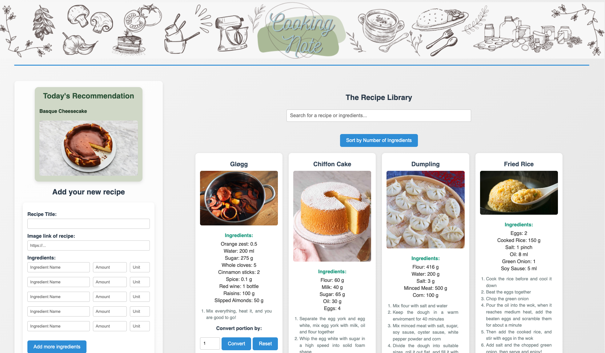
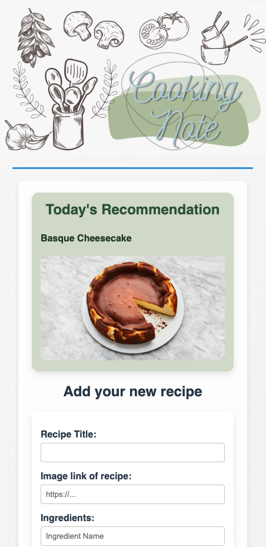
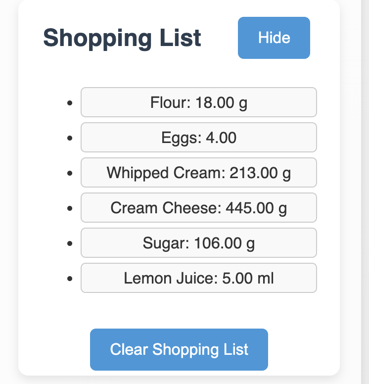

# 🍳 Cooking Note

**Cooking Note** is a recipe management web app built to help users organize, discover, and interact with their favorite recipes. This was my **first JavaScript project**, where I explored dynamic DOM manipulation, form handling, interactivity, and simple animations to create a modern and user-friendly experience.

> 💡 I'm currently having my full-stack courses. This project marks the end of my JavaScript phase.

## 📸 Screenshots

You can view some key features in action:

<div style="display: flex; gap: 10px;">
    
    
    
</div>

## 🌐 Live Demo

🔗 [View the deployed website here](https://cookingnote.netlify.app/)

## 🚀 Features

- 📝 **Add New Recipes**: Input title, image, ingredients, and instructions.
- 🎲 **Today’s Recommendation**: Randomly suggests a recipe each time the page loads.
- 📚 **Recipe Library**: Card-style layout showing saved recipes.
- 🔍 **Search & Sort**: Filter by title/ingredient and sort by ingredient count.
- 🛒 **Shopping List**: Add ingredients to a collapsible list.
- ⏱️ **Cooking Timer**: Start a countdown timer for your dishes.
- 🎨 **Smooth Transitions & Responsive Design**: Clean, animated UI with a Nordic-inspired color scheme.

## 🛠️ Tech Stack

- **HTML5 + CSS3**: Semantic structure and responsive styling
- **JavaScript**: DOM handling, form validation, logic for features

## 📁 Folder Structure

```bash
.project-root/
├── index.html # Main HTML file
├── styles.css # Styling and layout
├── recipeApp.js # Core JavaScript logic
├── assets/ # Images
└── README.md # Project documentation
```

## 📚 Learning Reflections

As my first JavaScript project, I learned how to:

- Handle events and user input via forms
- Manipulate and update the DOM in real time
- Organize functions for modular interactivity
- Style with CSS animations and responsive layout
- Think like a user and design around real needs

## 🔮 Upcoming Improvements

- Type tags and background color themes
- Popup form and floating shopping list
- LocalStorage integration
- A complete **React version** after finishing React/Node.js courses

## 👩🏻‍💻 Author

Made with 💛 by Jianxin

Currently enrolled in **HackYourFuture Full-stack Web Development Program**.

---
